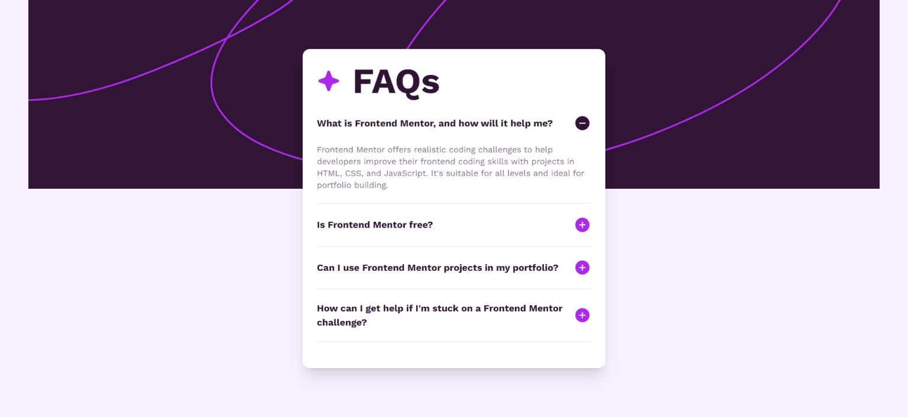

# FAQs Accordion

Welcome to the FAQs Accordion project! This project is a simple and customizable Frequently Asked Questions (FAQs) accordion built using Vite, React, and Tailwind CSS. It allows you to display a list of frequently asked questions with collapsible answers, providing a clean and organized way to present information.



## Features

- Clean and responsive accordion design
- Easy integration into existing projects
- Customizable styles using Tailwind CSS
- Smooth animations for accordion transitions

## Getting Started

### Prerequisites

Before you begin, ensure you have the following installed on your machine:

- [Node.js](https://nodejs.org/) (v14 or higher)
- [npm](https://www.npmjs.com/) or [Yarn](https://yarnpkg.com/)

### Installation

1. Clone the repository:

   ```bash
   git clone https://github.com/KamalJoshi-web/faqs-accordion.git
   ```

2. Change into the project directory:

   ```bash
   cd faqs-accordion
   ```

3. Install dependencies:

   ```bash
   npm install
   ```

   or

   ```bash
   yarn
   ```
